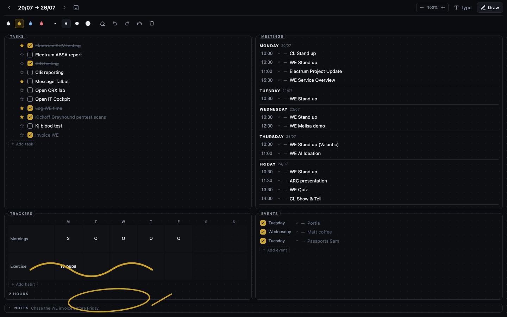
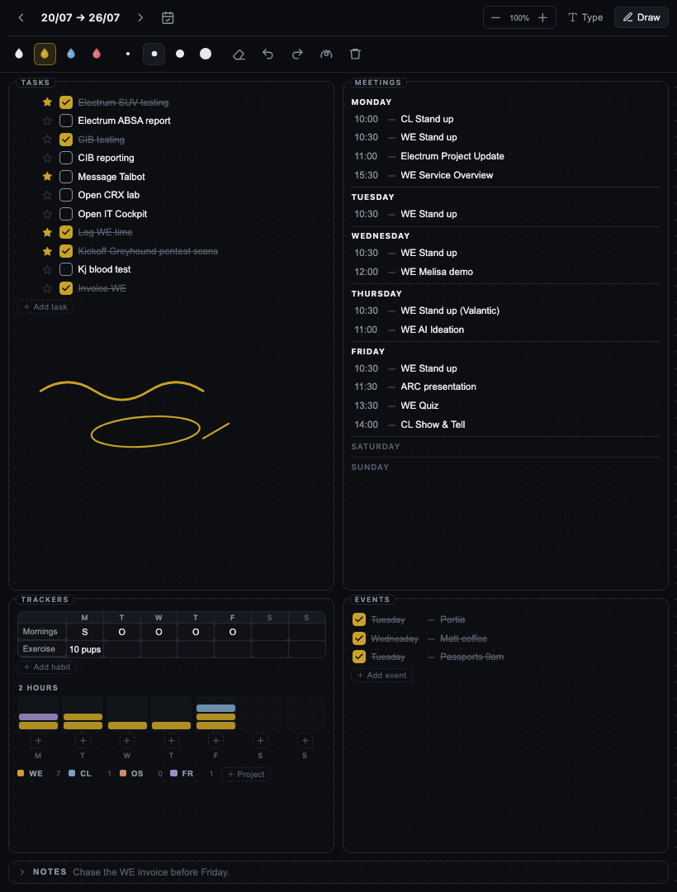

# Bullet

A weekly bullet journal page for Obsidian — tasks, meetings, events and habit
trackers laid out like a paper spread, with an Apple Pencil ink layer over the
top. Desktop and mobile.



## What it does

The page is a spread, not a list: tasks and meetings across the top, trackers and
events along the foot, exactly like the paper version. It stays two-up at every
window size and fits the screen without scrolling — the panels scroll inside
themselves when they need to, so the shape of the week is always in front of you.
On a phone in portrait the two columns get genuinely narrow — it still works, but
landscape is much more comfortable.

- **One page per week**, created automatically, named `2026-W30.md` by default.
- **Tasks** with tick boxes and a priority flag.
- **Meetings** grouped by day, each with a time.
- **Events** — a dated checklist for the things that aren't meetings.
- **Habit trackers** — a 7-column grid you fill in however you like: a tick, a
  number, a word.
- **Time blocks** — a stacked chart of sessions per day, colour-coded by project.
- **Handwriting** — draw anywhere on the page with an Apple Pencil. Pressure
  varies the stroke width. A finger scrolls instead of drawing, so your palm
  never leaves a mark.
- **Notes** — a strip along the foot, folded away until you want it.
- **Zoom** — − and + in the toolbar resize the whole page; tap the percentage to
  go back to 100%. The setting is remembered.

Everything is stored as ordinary markdown, so the page stays searchable and
readable outside the plugin.

## Installing with BRAT

1. Install the **BRAT** community plugin and enable it.
2. Run the command **BRAT: Add a beta plugin for testing**.
3. Paste `https://github.com/OfficialScragg/obsidian-bullet` and choose the
   latest version.
4. Enable **Bullet** in *Settings → Community plugins*.

BRAT will keep it updated as new releases are published.

### Installing manually

Download `main.js`, `manifest.json` and `styles.css` from the
[latest release](https://github.com/OfficialScragg/obsidian-bullet/releases/latest)
and drop them into `<vault>/.obsidian/plugins/bullet/`.

## Using it

Click the pencil in the ribbon, or run **Bullet: Open this week**. The page for
the current week is created if it doesn't exist yet.

| Command | What it does |
| --- | --- |
| Bullet: Open this week | Opens (creating if needed) the current week |
| Bullet: Open next week | Jumps forward a week |
| Bullet: Open previous week | Jumps back a week |
| Bullet: Open current page as markdown | Shows the raw markdown behind the page |
| Bullet: Open current note as a Bullet page | Switches a markdown note back to the page view |
| Bullet: Diagnose ink performance | Measures where drawing time goes on this device |



### Keyboard

- **Enter** in any row adds a new row below it.
- **Backspace** in an empty row deletes it.
- **Up / Down** move between rows.
- **Double-click** a tracker cell to drop a tick in it.

### Drawing

Hit **Draw** in the toolbar. With an Apple Pencil you can then write anywhere on
the page while a finger still scrolls it — that's the default, and it means your
palm is ignored. If you'd rather draw with a finger too, turn on *Draw with
finger* in settings.

While drawing, the right of the ink toolbar shows how long the last stroke took
to appear and the gap between drawing frames. The gauge button next to the bin
opens the full report — canvas size, paint, redraw and save cost — which you can
copy or write into the vault as a note. No command palette needed, which matters
on a tablet.

The eraser removes whole strokes rather than nibbling at them, which is far more
predictable on a touch screen. Undo and redo apply to strokes only; they don't
touch your typing.

Ink is anchored to the width of the page, so a page drawn on an iPad reopens in
proportion on a desktop. It is not anchored to individual lines of text — if you
add ten tasks after annotating, the text moves and the ink doesn't.

## Settings

**Notes** — the folder, the filename format, which day starts the week, whether
this week's page is created automatically, and whether unfinished tasks carry
over from last week.

**Page layout** — habit rows, project codes, the time-block label, and any
recurring meetings to pre-fill. Recurring meetings are one per line:

```
Mon | 10:00 | CL Stand up
Mon | 10:30 | WE Stand up
Tue | 10:30 | WE Stand up
Fri | 14:00 | CL Show & Tell
```

**Ink** — pen colours, base width, finger drawing, and whether strokes are stored
compactly or as readable JSON.

**Appearance** — page size (the same control as the toolbar's − / +), and
whether Bullet ships its own dark palette or follows your theme's
colours. It uses its own palette on every theme unless you turn on *Follow
Obsidian theme colours*.

Habit rows and project codes seed a page only when it is created — editing them
later won't rewrite pages you've already filled in. You can always add or rename
a row directly on the page.

## The file format

A page is a normal markdown note with `bullet: weekly` in its frontmatter, which
is what tells the plugin to open it as a page rather than as text:

```markdown
---
bullet: weekly
week: 2026-W30
start: 2026-07-20
end: 2026-07-26
---

# 20/07 → 26/07

## Tasks

- [x] ⭐ Electrum SUV testing
- [ ] Electrum ABSA report

## Meetings

### Monday

- 10:00 — CL Stand up

## Events

- [x] Tuesday — Portia

## Trackers

| Habit | M | T | W | T | F | S | S |
| --- | --- | --- | --- | --- | --- | --- | --- |
| Mornings | S | O | O | O | O |  |  |

## Time

**2 Hours**

| Project | M | T | W | T | F | S | S |
| --- | --- | --- | --- | --- | --- | --- | --- |
| WE | 1 | 2 | 1 | 1 | 2 | 0 | 0 |

## Notes

## Ink

​```bullet-ink
#c9a227 2.4 120,340,50 8,2,62
​```
```

Tasks are standard checklist items, so Dataview and the Tasks plugin can see
them. Editing the file by hand is fine — reopen the page and your changes are
there. The one thing to avoid is putting your own `##` headings inside the Notes
section, since those read as new sections.

Tracker and time columns are always written Monday-first regardless of which day
you start the week on, so switching that setting won't shuffle existing data.

## Notes on the week number

Filenames use the ISO week-year, not the calendar year, because pairing a
calendar year with a week number collides at New Year — 1 January 2027 falls in
week 53 of 2026. `YYYY-[W]WW` gives `2026-W53` for that date, and every week gets
a unique filename.

## Building from source

```bash
npm install
npm run dev    # watch build
npm run build  # type-check and produce main.js
```

To cut a release, bump the version in `manifest.json`, `package.json` and
`versions.json`, then push a matching tag — the GitHub Action builds it and
attaches `main.js`, `manifest.json` and `styles.css`.

## Licence

MIT
